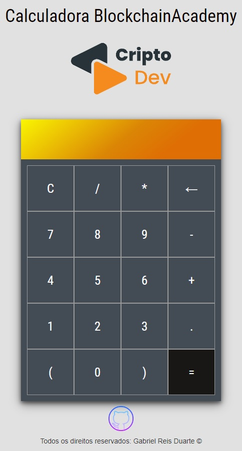

## Calculadora para o Projeto CriptoDev - Gama Academy

  

 

Se trata de um projeto de uma calculadora feita para a 1ª Fase do Bootcamp CriptoDev da GamaAcademy.

## Built With

Esse projeto foi construído utilizando-se as seguintes linguagens:

- HTML
- CSS3
- Javascript
- VsCode

## Funções

**📖 Cálculadora funcional por click e pelo teclado**

**🎨 Design personalizado**

  
### Obrigado!
  

